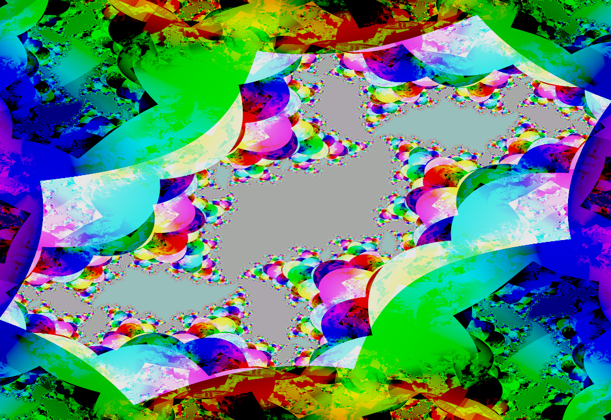

# azurescens

azurescens renders interactive fractal-like animations.

**Not recommended for people with photosensitive epilepsy!**

Currently it is a simple toy, and a platform for experimentation. It will
probably grow more behaviors over time.

## Quick start

Install Rust from [rustup.rs](https://rustup.rs/). The latest stable release is
fine. Make sure rustup has put the Rust tools in your `$PATH` — you may need
to restart your terminal.

Clone this repository and `cd` into it. azurescens is not yet available on
[crates.io](https://crates.io/); sorry!

Build it in release mode, so that optimizations are enabled:

    cargo build --release

This will take a little while, as Cargo downloads and builds a bunch of
dependencies. To be honest, the Rust compiler is pretty dang slow. Sorry about
that!

Then you can run azurescens with

    cargo run --release

Actually, the `run` command by itself will rebuild as necessary. But on a first
build, you may be surprised when the window opens some minutes later!

azurescens has been tested on Linux, macOS Sierra (10.12), and Windows 10. You
will need OpenGL 3.2 or later.

There is also [preliminary support for Android][android].

## User interface

There is not much UI yet.

Try **moving the mouse** within the window to get different behaviors.

Press `s` to take a screenshot, as a PNG file in the current directory.

## Performance

azurescens runs smooth as silk on my 2011-era non-gaming laptop, with Intel HD
Graphics 3000 onboard video. If you experience performance issues, **make sure
you are building in release mode**. If that doesn't help, you can lower the
feedback resolution by adjusting `FEEDBACK_TEXTURE_SIZE` in `src/main.rs`.

Alternately, if you crave ultra-hi-def, you can increase this constant. 4096
should work on any reasonable gaming GPU.

If you've done these things and still run into performance issues, please let
us know by [opening an issue on GitHub][issue].

## More documentation

[**The algorithm**](docs/algorithm.md)

[**How to hack on it**](docs/hacking.md)

[**Building for Android**][android]

## Shoutouts

Uncountable thanks to my good friend Michael Rule, who introduced me to this
whole approach. His implementation in Java may be the most comprehensive and
well-crafted version that exists.

tomaka's [glium library](https://crates.io/crates/glium) makes OpenGL
programming almost pleasant. It's in maintenance mode, but so is OpenGL these
days. One day I'll port azurescens to Vulkan.

`#rust-gamedev` on [Mozilla IRC](https://wiki.mozilla.org/IRC) helped me with
several thorny issues.

And of course, I am grateful to the [thousands of
people](https://thanks.rust-lang.org/rust/all-time) who have made Rust what it
is today.

[issue]: https://github.com/kmcallister/azurescens/issues
[android]: docs/android.md
