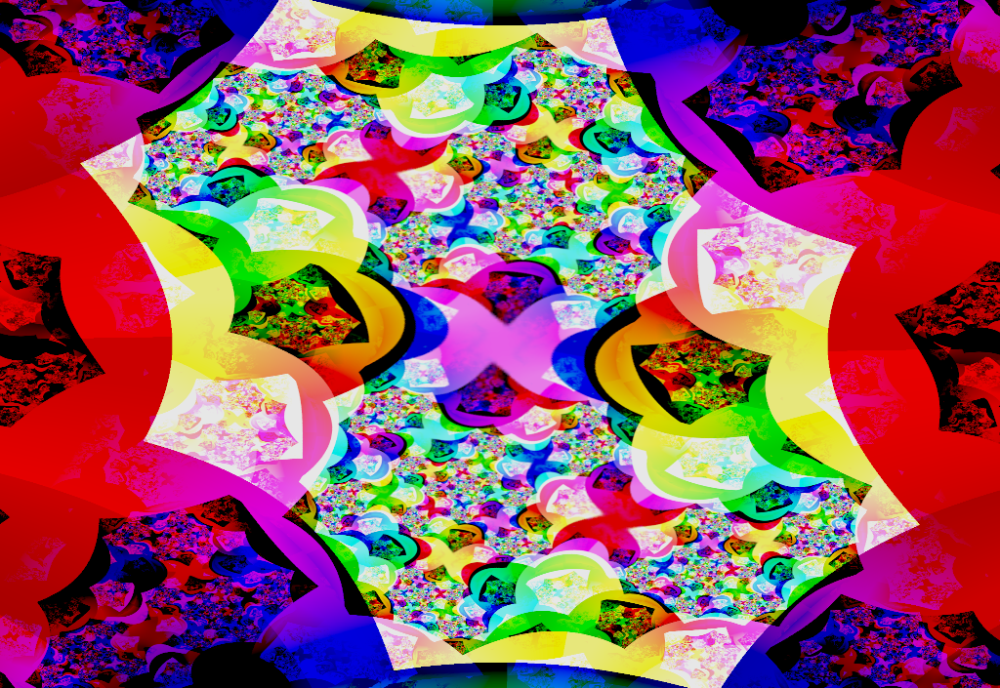

# azurescens

azurescens renders interactive fractal-like animations.

**Not recommended for people with photosensitive epilepsy!**

Currently it is a simple toy, and a platform for experimentation. It will
probably grow more behaviors over time.

## Quick start

Install Rust from [rustup.rs](https://rustup.rs/). The latest stable release is
fine. Make sure rustup has put the Rust tools in your `$PATH` — you may need
to restart your terminal.

Clone this repository and `cd` into it. azurescens is not yet available on
[crates.io](https://crates.io/); sorry!

Build it in release mode, so that optimizations are enabled:

    cargo build --release

This will take a little while, as Cargo downloads and builds a bunch of
dependencies. To be honest, the Rust compiler is pretty dang slow. Sorry about
that!

Then you can run azurescens with

    cargo run --release

Actually, the `run` command by itself will rebuild as necessary. But on a first
build, you may be surprised when the window opens some minutes later!

Try **moving the mouse** within the window to get different behaviors.

azurescens is tested on Linux, but will quite likely work on other platforms.
You will need OpenGL 3.0 or later. OpenGL ES will possibly work. Bottom line,
try it and report back with your findings!

## The algorithm

Here's how it works, in a nutshell.

We interpret the screen as a region of the [complex plane] ℂ, for example

> (-1 to 1) + (-1 to 1)*i*

We pick a function *f*: ℂ → ℂ. Say we want to render a new frame of the
animation. For each pixel, we interpret its coordinate as a complex number *z*.
We then copy the color from the previous frame at the point *f*(*z*). We also
draw some stuff on top in order to seed the iteration with interesting
structure.

A simple choice for *f* is

> *f*(*z*) = *z*2 + *c*

for some complex parameter *c*. This produces images very similar to [Julia set
fractals]. (The Julia set is the set of points for which repeated iteration of
*f* does not fly off to infinity.)

However, the animation also displays interesting non-equilibrium behavior, if
we vary the parameter *c* in-between frames. In azurescens this is accomplished
by moving the mouse. Skilled pilots can achieve some very interesting effects.

[complex plane]: https://en.wikipedia.org/wiki/Complex_plane
[Julia set fractals]: https://en.wikipedia.org/wiki/Julia_set

## Performance

azurescens runs smooth as silk on my 2011-era non-gaming laptop, with Intel HD
Graphics 3000 onboard video. If you experience performance issues, **make sure
you are building in release mode**. If that doesn't help, you can lower the
feedback resolution by adjusting `FEEDBACK_TEXTURE_SIZE` in `src/main.rs`.

Alternately, if you crave ultra-hi-def, you can increase this constant. 4096
should work on any reasonable gaming GPU.

If you've done these things and still run into performance issues, please let
us know by [opening an issue on GitHub][issue].

## Implementation details

The feedback happens between two OpenGL textures in a ping-pong fashion. These
have a fixed square size, regardless of the size of the window or screen. It's
determined by the constant `FEEDBACK_TEXTURE_SIZE` in `src/main.rs`.

Each step of the feedback inverts colors, which produces a lot of the
interesting structure. This is why we only render every other step to the
screen; otherwise it would be far too blinky.

The shader programs (as GLSL source code strings) are baked into the azurescens
executable at compile time. This means the executable is self-contained and
does not rely on any external files. However, it also means you need to
recompile every time you change a shader. We plan to introduce a "dynamic
shaders" option to speed up the code/build/run cycle.

## Experimentation and improvement

The actual feedback function is implemented in `src/shaders/feedback.glsl`,
which is probably the most interesting file in the whole project. This is a
great place to start experimenting. There are a million different directions
you can go with this basic idea. Pull requests will be accepted, especially if
they add functionality without removing any. (We will need a mode-switching
interface at some point.)

Many ideas for improvement are available in the [issue tracker][issue]. See
also some old articles:
[1](http://wealoneonearth.blogspot.com/2007/09/more-fractal-video-feedback.html),
[2](http://wealoneonearth.blogspot.com/2007/09/more-screenshots.html),
[3](http://wealoneonearth.blogspot.com/2008/01/ezeiz-c_24.html),
[4](http://wealoneonearth.blogspot.com/2008/01/ezeiz-c.html), and many others
from that group blog.

Long ago, I made [a similar program][phosphene] in x86-16 assembly which fits
in a master boot record — 446 bytes.

[phosphene]: https://github.com/kmcallister/phosphene

## Shoutouts

Uncountable thanks to my good friend Michael Rule, who introduced me to this
whole approach. His implementation in Java may be the most comprehensive and
well-crafted version that exists.

tomaka's [glium library](https://crates.io/crates/glium) makes OpenGL
programming almost pleasant. It's in maintenance mode, but so is OpenGL these
days. One day I'll port azurescens to Vulkan.

`#rust-gamedev` on [Mozilla IRC](https://wiki.mozilla.org/IRC) helped me with
several thorny issues.

And of course, I am grateful to the [thousands of
people](https://thanks.rust-lang.org/rust/all-time) who have made Rust what it
is today.

[issue]: https://github.com/kmcallister/azurescens/issues
